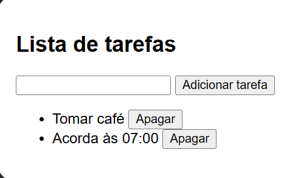

Este código é um pequeno aplicativo web que permite ao usuário adicionar e remover tarefas em uma lista. Através do uso do JavaScript, o código controla a interação do usuário com a página. O usuário pode digitar o texto de uma tarefa no campo de input e pressionar a tecla "Enter" ou clicar no botão "Adicionar Tarefa" para adicionar uma nova tarefa à lista. Cada tarefa é representada como um item de lista "li" e cada item de lista tem um botão "Apagar" associado a ele. Quando o usuário clica no botão "Apagar", a respectiva tarefa é removida da lista. As tarefas adicionadas são salvas no localStorage do navegador, permitindo que sejam mantidas mesmo após a página ser recarregada. Assim, as tarefas salvas são carregadas e exibidas automaticamente quando o usuário retorna à página.

